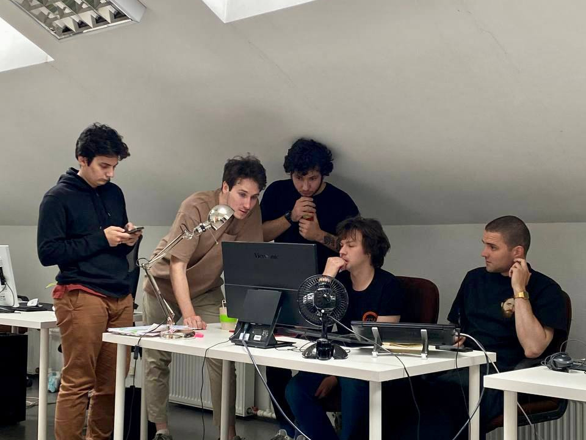

About us
========

The BlocksNet is developed and maintained by the `IDU <https://idu.itmo.ru/>`__ team.

The Institute of Design and Urban Studies (IDU) is an educational and project-research
unit of ITMO University aimed at developing interdisciplinary competencies and scientific
approach for solving complex urban problems using information technologies based on the
principles of sustainability and social orientation.

Contacts
--------

.. mdinclude:: ../../README.md
   :start-after: <!-- contacts-start -->
   :end-before: <!-- contacts-end -->

Publications
------------

.. mdinclude:: ../../README.md
   :start-after: <!-- publications-start -->
   :end-before: <!-- publications-end -->
